## Dashdot – A Minimal Open Source Note-Taking App  
**Developed & Designed by Konstantinos Kadoglou**

---

### 🚧 Project Status

Dashdot is an experimental, personal project exploring architectural patterns in Kotlin Multiplatform (KMP) development. The ultimate goal is to make it a fully functional cross-platform note-taking app.

Right now, it’s in active development. Expect frequent updates to the roadmap, architecture, and features. Along the way, I’ll share some UI/UX decisions, design guidelines, and maybe even some mockups.

---

### 💡 Tech Stack

- **Compose Multiplatform (CMP)**  
  Used for the UI across platforms. Android support is smooth, and while iOS isn’t as plug-and-play as APKs, it’s still supported.

- **Kotlin Multiplatform (KMP)**  
  A single codebase, written entirely in Kotlin, powering all platforms.

- **Firebase**  
  Chosen for now as the quickest way to get things up and running. You’re free to swap it out with your preferred backend/database. You can swap the firebase configs with your own files and use your firebase database. 

---

### 🧭 Goals

- Build a clean, modular KMP architecture
- Ensure the app is easily extensible for contributors
- Provide design mockups and UX patterns as the UI evolves
- Deliver a smooth experience on Android and iOS.

---

### 🏗️ Multi-Module Architecture

```mermaid
---
config:
  layout: dagre
---
flowchart TD

  %% Presentation Layer
  subgraph Presentation["📦 Presentation"]
    resources
    Core
    Features
  end

  %% Domain Layer
  subgraph Domain["📦 Domain"]
    Repositories
    UseCases
  end

  %% Data Layer
  subgraph Data["📦 Data"]
    Sources
  end

  %% Sources Layer
  subgraph Sources["📦 Sources"]
    Local
    Rest
    System
  end

  %% System Layer
  subgraph System["📦 System"]
    Sys1["sys1"]
    Sys2["sys2"]
    Sys3["..."]
  end

  %% API Layer
  subgraph API["📦 API"]
    API1["api1"]
    API2["api2"]
    APIX["..."]
  end

  %% Rest Layer
  subgraph Rest["📦 Rest"]
    client --> API1
    client --> API2
    client --> APIX
    API
  end

  %% DAO Layer
  subgraph DAO["📦 DAO"]
    DAO1["dao1"]
    DAO2["dao2"]
    DAOX["..."]
  end

  %% Local Layer
  subgraph Local["📦 Local"]
    database --> DAO1
    database --> DAO2
    database --> DAOX
    DAO
  end

  %% Repositories Layer
  subgraph Repositories
    Repo1["repo1"]
    Repo2["repo2"]
    Repo3["..."]
  end

  %% Use Cases Layer
  subgraph UseCases["📦 UseCases"]
    UC1["group1"]
    UC2["group2"]
    UC3["..."]
  end

  %% Data Flow
  DAO --> Repositories
  API --> Repositories
  System --> Repositories
  Repositories --> UseCases
  Domain --> Presentation

  %% Styling
  style Data fill:#f8ebff,stroke:#f8ebff,stroke-width:2px
  style Sources fill:#f4e0ff,stroke:#f4e0ff,stroke-width:2px
  style Local fill:#efd1ff,stroke:#6e6e6e,stroke-width:2px
  style Rest fill:#efd1ff,stroke:#6e6e6e,stroke-width:2px
  style System fill:#efd1ff,stroke:#6e6e6e,stroke-width:2px
  style DAO fill:#e7baff,stroke:#6e6e6e,stroke-width:2px
  style API fill:#e7baff,stroke:#6e6e6e,stroke-width:2px

  style Domain fill:#dcecff,stroke:#dcecff,stroke-width:2px
  style Repositories fill:#bfdcff,stroke:#6e6e6e,stroke-width:2px
  style UseCases fill:#bfdcff,stroke:#6e6e6e,stroke-width:2px

  style Presentation fill:#d4ffe9,stroke:#d4ffe9,stroke-width:2px
```

### 🤝 Contributions

For now, this is more of a personal playground. But if you’re curious, feel free to watch the repo, open issues, or suggest ideas. Contributions may be welcome once the foundation is more stable.
